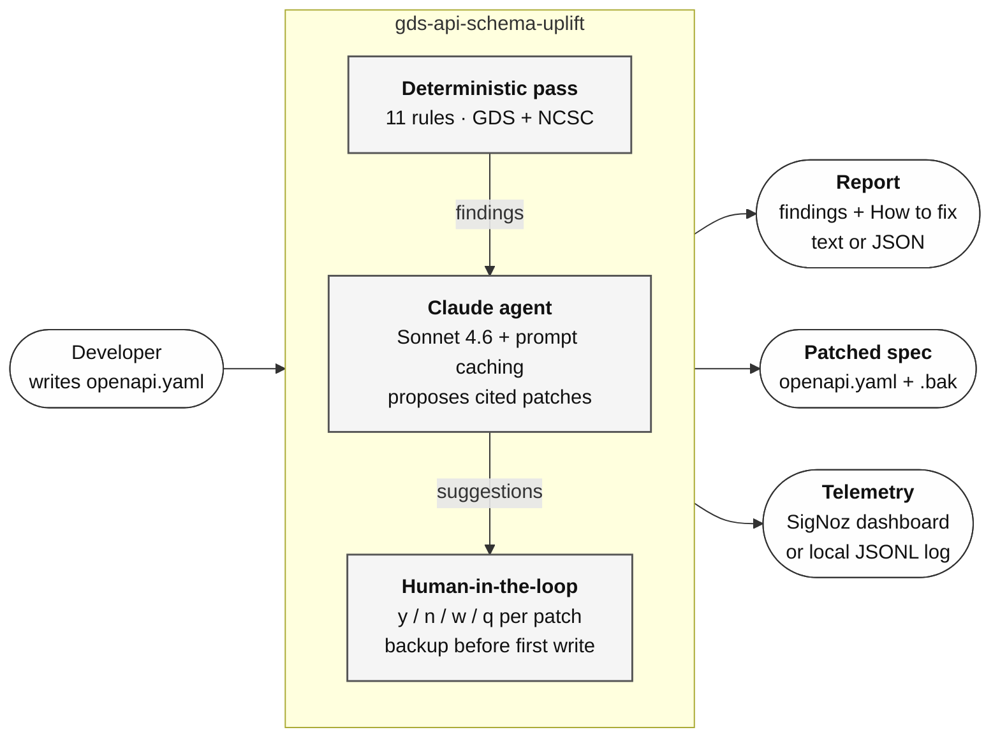

# Architecture

Two diagrams. The first is what to put on a stakeholder slide — it tells the
story in one look. The second is for anyone digging into the code.

Both are Mermaid. Copy the source into https://mermaid.live to export as
PNG or SVG, or point your slide tool at it directly if it renders Mermaid
(Notion, Obsidian, Deckset, most static-site generators). GitHub renders
Mermaid natively — the diagrams below already look right in this file.

---

## 1. Stakeholder overview

**Use this in the deck.** Five boxes, three arrows in, three arrows out.
Reads left-to-right in about three seconds.



**Narration cues for the slide:**

- Developer's spec goes in.
- **Deterministic pass** catches everything that can be pattern-matched
  against a GDS or NCSC clause (11 rules, no AI, no network).
- **Claude agent** takes those findings and drafts concrete patches,
  quoting the specific clause each fix implements.
- **Human-in-the-loop** — every patch requires an explicit `y` before it
  touches disk. `.bak` written once, before the first mutation.
- Three outputs: a findings report the developer reads, a patched spec
  they can push, and telemetry the team lead watches.

## 2. Data flow for one finding

**Use this if a technical stakeholder asks "but how does it actually
work?"** Traces one violation from detection to on-disk fix.

```mermaid
flowchart TD
    spec[openapi.yaml] --> load[Load with ruamel.yaml<br/>round-trip parser<br/>tracks line/column]
    load --> gate{OpenAPI version?}
    gate -- 3.1 --> passgate[proceed]
    gate -- 3.0 --> passgate
    gate -- 2.0 --> reject[exit 3<br/>upgrade required]

    passgate --> rules[Run 11 rules against the spec]
    rules --> finding[Finding<br/>rule_id, severity, location,<br/>line, snippet, clause_id]

    finding --> report[Text/JSON report<br/>+ How to fix panel]
    finding --> agent

    subgraph agent[Claude agent per finding]
        direction TB
        prompt[Build cached system prompt<br/>with full GDS+NCSC corpus]
        call[Call Sonnet 4.6<br/>with propose_patch tool]
        parse[Parse RFC 6902 patch<br/>+ clause_quote + rationale]
        validate{Patch validates<br/>against OpenAPI?}
        prompt --> call --> parse --> validate
    end

    validate -- yes --> offer[Offered suggestion<br/>with unified diff]
    validate -- no --> drop[Drop before display<br/>increment patches_dropped]

    offer --> loop[Approval prompt<br/>y / n / w / q]
    loop -- y --> revalidate{Re-validate against<br/>current spec state}
    revalidate -- ok --> write[.bak once, then<br/>ruamel round-trip write]
    revalidate -- stale --> skip[skipped_invalid<br/>an earlier approval<br/>invalidated this]

    loop -- n --> nextfinding[next finding]
    loop -- w --> showclause[Show full clause] --> loop
    loop -- q --> done[stop; prior writes stand]

    write --> mutated[openapi.yaml + .bak]

    write --> tel[OTel span-event<br/>USER/APPROVES/FINDING<br/>+ JSONL log]
    offer --> costmetric[gds_uplift.llm.cost_usd<br/>counter]
    costmetric --> tel

    classDef default fill:#fefefe,stroke:#333,stroke-width:1px,color:#111
    classDef gate fill:#fff5e1,stroke:#a86400,stroke-width:1.2px
    classDef fail fill:#ffefef,stroke:#a80000,stroke-width:1.2px
    classDef success fill:#efffef,stroke:#00791f,stroke-width:1.2px
    class gate,validate,revalidate gate
    class reject,drop,skip fail
    class write,mutated success
```

**What this diagram pins:**

- **The version gate is a hard exit.** 2.0 specs get exit code 3, not
  reported as clean.
- **Every AI suggestion goes through the validation gate before a human
  sees it.** An invalid patch is dropped, not shown.
- **Approvals re-validate against the current state**, not the state at
  proposal time — the reason `SKIPS_INVALID` happens when an earlier
  approval moves the target of a later patch (e.g. GDS-003 renaming
  `/getUserList` → `/v1/getUserList` invalidating a GDS-004 patch that
  still points at `/getUserList`).
- **The `.bak` is written once, before the first mutation.** A run that
  rejects everything leaves no backup file behind.
- **Telemetry is a downstream, not upstream, concern.** It observes the
  loop; it never gates it.

---

## Exporting for slides

**One-click PNG/SVG:**

1. Copy the ```` ```mermaid ```` block source from this file.
2. Paste into https://mermaid.live.
3. Click *Actions → Export as PNG* (or SVG for scalable slides).
4. Drop into Keynote / PowerPoint / Google Slides.

**From the repo, no external site:**

```bash
npm install -g @mermaid-js/mermaid-cli
mmdc -i docs/architecture.md -o docs/architecture.png
# or for a specific diagram, extract it into a .mmd file first
```

**If your slide tool renders Mermaid directly** (Notion, Obsidian, Slidev,
Deckset ≥ 5, VS Code with the Marp extension), just paste the source.
